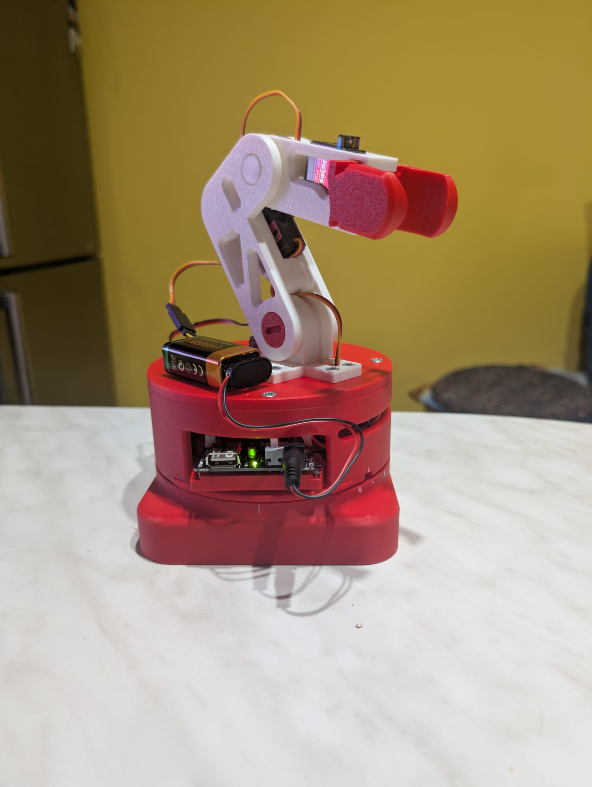
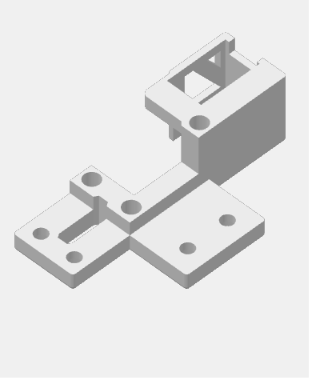
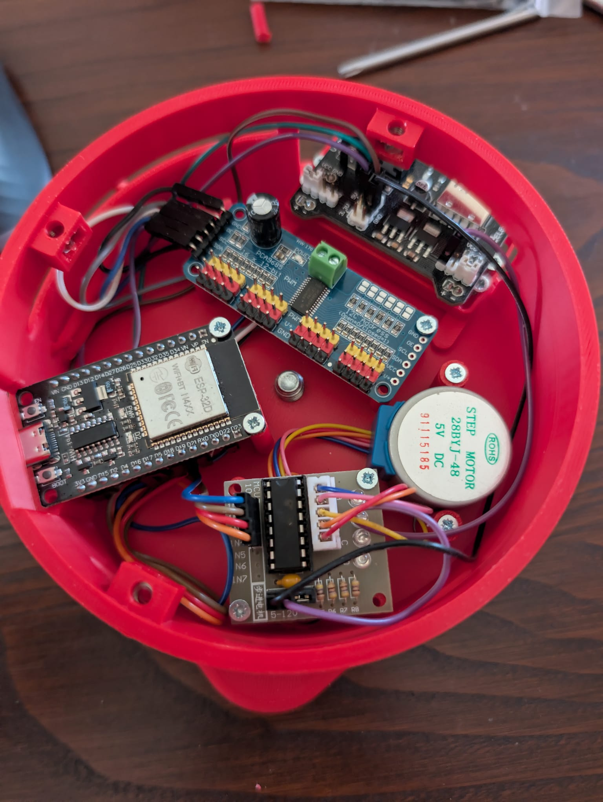
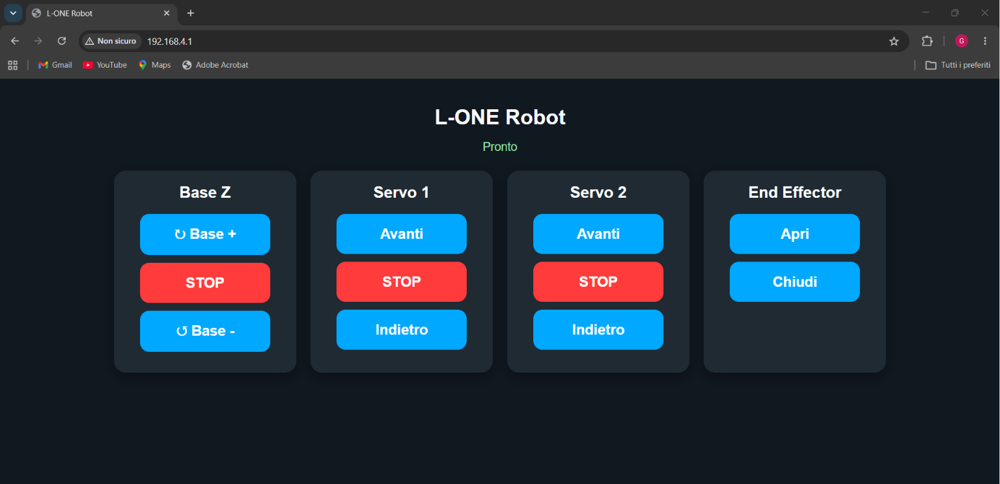

# ESP32 Robotic Arm Platform

<p align="center">
  
</p>
<p align="center">
<b>Custom evolution of the L-ONE Cyberbrick Desktop Robotic Arm</b><br>
Mechanical redesign • Embedded electronics • ESP32 firmware • Web interface
</p>

---

# Overview

This project is a complete redesign of the original **L-ONE Cyberbrick Desktop Robotic Arm**.

Instead of simply assembling the original model, the goal was to redesign the platform by improving its mechanical structure, integrating custom electronics inside the base and developing a completely new control architecture based on an ESP32 microcontroller.

The result is a cleaner, stronger and more modular robotic platform that can be controlled directly from any web browser through a local WiFi network.

---

# Why this project?

The original L-ONE Cyberbrick project is an excellent educational robotic platform.

This repository documents how it has been transformed into a completely customized version by redesigning several mechanical components, integrating embedded electronics and developing custom firmware.

Every modification presented here has been designed, manufactured and tested during the development of this project.

---

# Highlights

- 🤖 Complete mechanical redesign
- ⚡ ESP32-based control architecture
- 🌐 Browser-based WiFi control
- 🎛️ PCA9685 servo controller
- ⚙️ Stepper motor upgrade
- 🔩 Reinforced mechanical structure
- 🏗️ Internal electronics compartment
- 📚 Fully documented CAD files

---

# Mechanical Improvements

<p align="center">
  
</p>

Compared to the original project, the following improvements have been implemented.

## Base Assembly

- Enlarged fixed base
- Enlarged rotating base
- Internal compartment for electronics
- Integrated power distribution
- External ELEGOO power switch

## Base Rotation

<p align="center">
  
</p>

The rotating base has been redesigned by introducing:

- Bearing support
- 28BYJ-48 stepper motor
- ULN2003 driver
- Improved structural rigidity

## Joint 1 Redesign

<p align="center">
  
</p>

The original servo holder has been completely redesigned.

The servo motor is now mounted on an independent support instead of being integrated into the rotating cover.

This solution improves:

- maintenance
- accessibility
- structural rigidity

## Mechanical Reinforcement

Critical structural points have been redesigned using screw fasteners.

This solution significantly improves the robustness of the entire robotic arm compared to the original design.

---

# Electronics Integration

<p align="center">
  
</p>

The enlarged rotating base houses all control electronics.

Integrated hardware:

- ESP32
- PCA9685 Servo Driver
- ULN2003 Stepper Driver
- ELEGOO MB V2

The result is a compact and protected embedded control system.

---

# Software Architecture

<p align="center">
  
</p>

A completely custom firmware has been developed for ESP32.

Main features:

- Local WiFi Access Point
- Embedded Web Server
- Browser-based robot control
- Servo control
- Stepper motor control
- HTML
- CSS
- JavaScript
- LittleFS filesystem

---

# Hardware Architecture

```text
                Browser
                   │
              WiFi Network
                   │
                ESP32
        ┌──────────┴──────────┐
        │                     │
    PCA9685               ULN2003
        │                     │
 Servo Motors          Stepper Motor
```

---

# Repository Structure

```text
cad/
│
├── 3mf_files/
└── solidworks/

firmware/

images/

web_interface/
```

---

# Technologies

## Embedded

- ESP32
- Arduino Framework
- PCA9685
- ULN2003
- LittleFS

## Software

- HTML
- CSS
- JavaScript

## CAD

- SolidWorks
- Bambu Studio
- 3D Printing

## Robotics

- Servo Motors
- Stepper Motors
- Embedded Integration

---

# Project Status

## ✅ Version 1.0 — First Complete Prototype

Implemented features:

- Complete mechanical redesign
- Embedded electronics integration
- ESP32 firmware
- Browser-based control
- Ready-to-print CAD files
- Complete project documentation

---

# Future Development

## Branch A

Linear fourth axis.

## Branch B

Integration with Makerslab Arm Robot Control.

---

# Gallery

<p align="center">
  
  
</p>

---

# Acknowledgements

This project is based on the original **L-ONE Cyberbrick Desktop Robotic Arm**.

This repository documents all custom mechanical, electronic and software developments introduced during the creation of this robotic platform.
