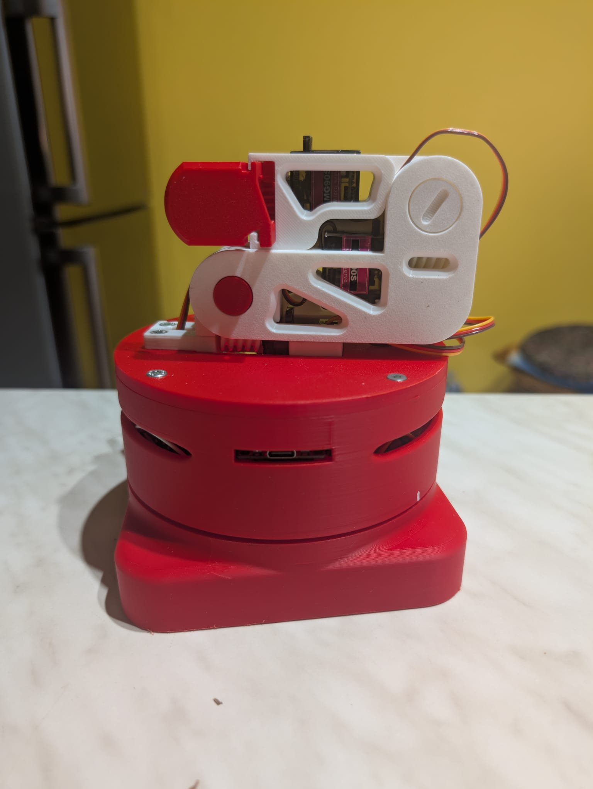
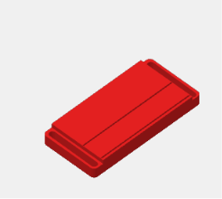
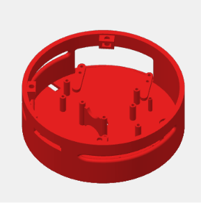
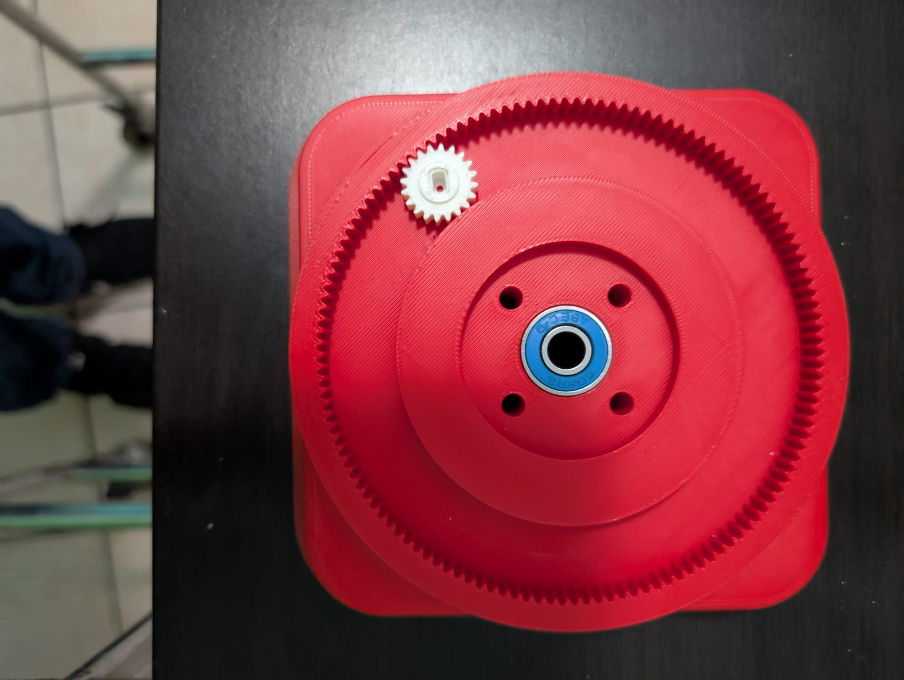

# ESP32 Robotic Arm Platform

## Overview

Custom evolution of the L-ONE Cyberbrick robotic arm platform.

<p align="center">
  <a href="images/Robot_overview.jpeg">
    
    
  </a>
</p>


This project combines mechanical redesign, electronics integration and custom ESP32 firmware to create a fully wireless desktop robotic platform.

Version 1.0 is completed.

---

## Main Modifications

### Mechanical Improvements

Compared to the original L-ONE Cyberbrick design, several modifications were introduced:

- Enlarged fixed base.
- Enlarged rotating base.
- Internal compartment created for electronics integration.
- Bearing support added to the base to improve stability and load distribution.
- Replacement of the original base drive system with a 28BYJ-48 stepper motor and ULN2003 driver.
- Redesigned rotating cover with screw and nut fastening for improved rigidity and easier maintenance.
- Completely redesigned Joint 1 servo support.
- Joint 1 servo is now independently mounted using dedicated fastening screws.
- Modified worm gear assemblies to allow internal locking screws.
- Reinforced the most critical mechanical areas using screw fasteners to improve robustness and reliability.
- External ELEGOO power module with integrated ON/OFF switch.

<p align="center">
  <a href="images/Adattatore_Elego.png">
    
    
    
    
  </a>
</p>
---

## Electronics Integration

Integrated components:

- ESP32 microcontroller
- PCA9685 servo controller
- ULN2003 stepper driver
- ELEGOO MB V2 power supply module

All electronics are housed inside the enlarged rotating base.

<p align="center">
  <a href="images/electronic_overview.jpeg">
    
  </a>
</p>

---

## Software Architecture

Custom firmware developed for ESP32.

Features:

- Local WiFi Access Point
- Embedded Web Server
- Browser-based control interface
- HTML + CSS + JavaScript frontend
- LittleFS filesystem integration

Development environment:

- Arduino IDE
- LittleFS uploader plugin

---

## Hardware Architecture

```text
ESP32
 ├── PCA9685 → Servo Motors
 ├── ULN2003 → Stepper Motor
 ├── LittleFS → Web Interface
 └── WiFi → Browser Control
```

---

## Technologies

### Embedded & Electronics

- ESP32
- PCA9685
- ULN2003
- LittleFS
- Embedded systems

### Software

- Arduino Framework
- HTML
- CSS
- JavaScript

### Robotics

- Servo motors
- Stepper motors
- Robotic arm integration

### CAD & Manufacturing

- SolidWorks
- Bambu Studio
- 3D Printing

---

## Project Status

✅ Version 1.0 completed

Current features:

- Mechanical redesign completed.
- Electronics integration completed.
- Custom ESP32 firmware completed.
- Embedded web interface completed.

---

## Planned Expansions

### Branch A — Linear Axis

Future implementation of a 4th axis using:

- Linear rail
- GT2 belt system
- Stepper motor

### Branch B — Remote Control

Future integration with:

- Makerslab Arm Robot Control App

---

## Gallery

Pictures and videos will be added soon.

---

## Acknowledgements

Original mechanical design inspired by the L-ONE Cyberbrick robotic arm project.

This repository documents the custom mechanical, electronic and software modifications introduced during the development of this platform.
